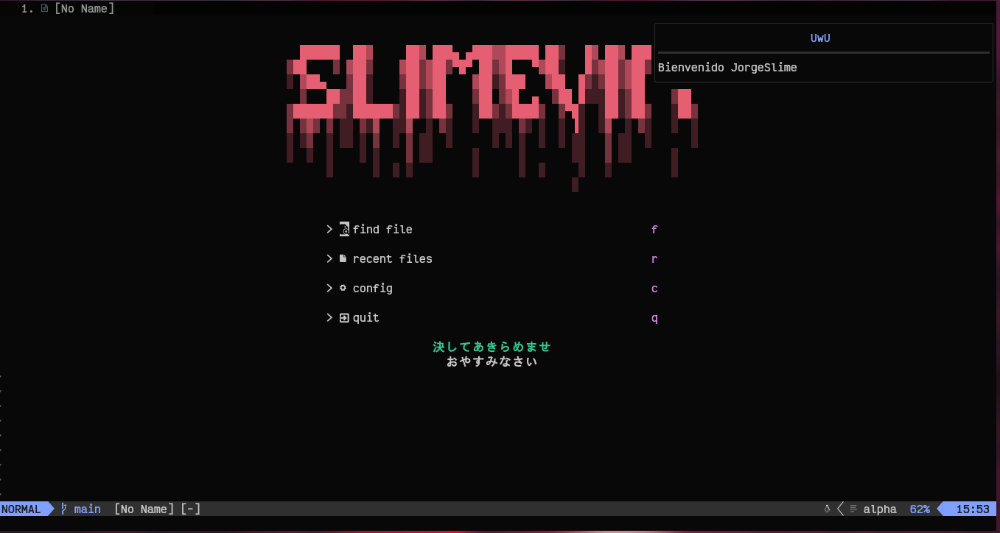
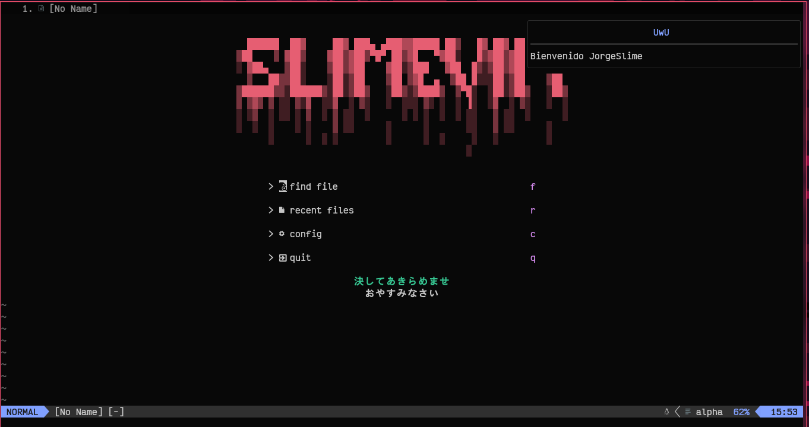

<h1 align="center">WELCOME TO SLIMEVIM</h1>

  

  
  
  

## Show Case

  

## ✔️ List Plugins  
- Coc
- Coc-Snippets
- Neo-Tree
- Lualine
- Bufferline
- Vim-Floaterm
- Telescope
- Nvim-Treesitter
- Plenary.nvim
- Indent-blankline
- Compitest
- Colorizer
- Notify
## 📂 File Structure
<pre>
~/.config/nvim
├── lua
│   ├── pluggins
│   │   ├── bufferline.lua
│   │   ├── coc.lua
│   │   ├── dashboard.lua
│   │   ├── discord.lua
│   │   ├── floaterm.lua
│   │   ├── lua_tree.lua  
│   │   ├── lua_line.lua
│   │   ├── sintaxis.lua
│   │   ├── telescope.lua
│   │   ├── themes.lua
│   │   └── treesiter.lua
│   └── 
│       ├── commands.lua
│       ├── mappings.lua
│       ├── settings.lua
│       └── theme.lua
└── init.lua
</pre>
