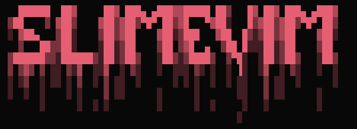

<h1 align="center">Welcome to SlimeVim</h1>

<div align="center">
  
</div>

<div align="center">
  <a href="https://github.com/neovim/neovim">
    
  </a>
  
  
</div>

## Show Case

<div align="center">
  
</div>

#$ ⚒️ Install
clone repository:
```
git clone https://github.com/Cris-lml007/NeoPlus.git && mv ./NeoPlus/* ~/.config/nvim/ && cd ~/.config/nvim/ && nvim -u setup/init.lua
```

## ✔️ List Plugins

- [Coc](https://github.com/neoclide/coc.nvim)
- [Coc-Snippets](https://github.com/neoclide/coc-snippets)
- [Neo-Tree](https://github.com/kyazdani42/nvim-tree.lua)
- [Lualine](https://github.com/hoob3rt/lualine.nvim)
- [Bufferline](https://github.com/akinsho/nvim-bufferline.lua)
- [Vim-Floaterm](https://github.com/voldikss/vim-floaterm)
- [Telescope](https://github.com/nvim-telescope/telescope.nvim)
- [Nvim-Treesitter](https://github.com/nvim-treesitter/nvim-treesitter)
- [Plenary.nvim](https://github.com/nvim-lua/plenary.nvim)
- [Indent-blankline](https://github.com/lukas-reineke/indent-blankline.nvim)
- [Compitest](https://github.com/akinsho/compitest.nvim)
- [Colorizer](https://github.com/norcalli/nvim-colorizer.lua)
- [Notify](https://github.com/rcarriga/nvim-notify)

## 📂 File Structure
<pre>
~/.config/nvim
├── lua
│   ├── pluggins
│   │   ├── bufferline.lua
│   │   ├── coc.lua
│   │   ├── dashboard.lua
│   │   ├── discord.lua
│   │   ├── floaterm.lua
│   │   ├── lua_tree.lua  
│   │   ├── lua_line.lua
│   │   ├── sintaxis.lua
│   │   ├── telescope.lua
│   │   ├── themes.lua
│   │   └── treesiter.lua
│   └── 
│       ├── commands.lua
│       ├── mappings.lua
│       ├── settings.lua
│       └── theme.lua
└── init.lua
</pre>
